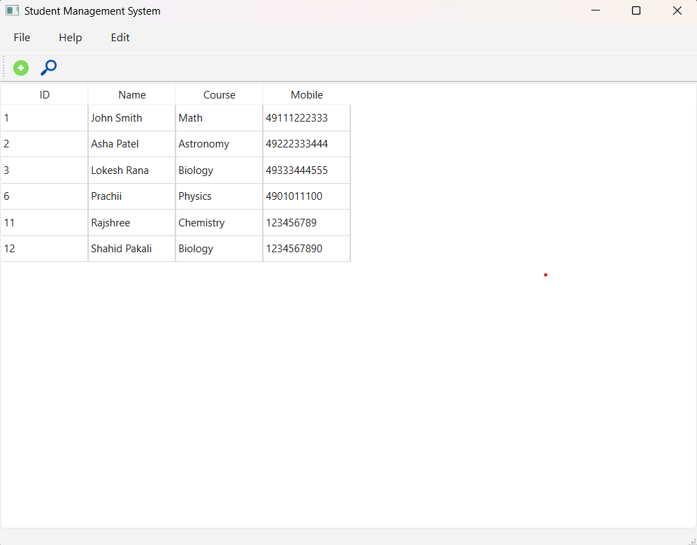
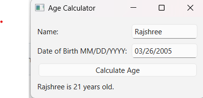

# 🎓 Student Management System & Age Calculator (PyQt6)

This project is a desktop application built using Python and PyQt6 that includes:

📚 Student Management System (CRUD operations with database)

🎂 Age Calculator (GUI-based utility)

It is a beginner-to-intermediate level project demonstrating GUI development + database integration.

# 🚀 Features
## 📌 Student Management System

➕ Add new student records

🔍 Search student by name

✏️ Edit existing student details

❌ Delete student records

📊 Display all records in table format

🗄️ SQLite database integration

## 📌 Age Calculator

👤 Input name and date of birth

📅 Calculate age instantly

⚠️ Error handling for invalid input

## 🛠️ Technologies Used

🐍 Python

🖥️ PyQt6 (GUI Framework)

🗄️ SQLite3 (Database)

📦 Standard Libraries (datetime, sys)

## 📂 Project Structure
project-folder/
│
├── main.py                 # Student Management System
├── age_calculator.py      # Age Calculator App
├── database.db           # SQLite Database
├── icons/                # Icons used in GUI
│   ├── add.png
│   └── search.png
└── README.md

## ⚙️ Installation & Setup
1️⃣ Clone the Repository
git clone https://github.com/RajshreeGholase/Student-Management-System-and-Age-Calculator.git
cd Student-Management-System-and-Age-Calculator
2️⃣ Install Dependencies
pip install PyQt6
3️⃣ Run the Applications
▶️ Run Student Management System
python main.py
▶️ Run Age Calculator
python age_calculator.py
🗄️ Database Setup

Make sure you create the SQLite database before running:

CREATE TABLE students (
    id INTEGER PRIMARY KEY AUTOINCREMENT,
    name TEXT,
    course TEXT,
    mobile TEXT
);

## 📸 Screenshots

### 🖥️ Student Management System

### 🎂 Age Calculator

## 💡 Learning Outcomes

Understanding PyQt6 GUI design

Implementing CRUD operations

Working with SQLite database

Handling user input and events

Building real-world desktop applications

## 🔮 Future Improvements

🔐 Add login authentication

📊 Export data to CSV/Excel

🌐 Convert into web app (Django/Flask)

🎨 Improve UI design (themes)

📱 Make it mobile-friendly

## 👩‍💻 Author

Rajshree Nandkumar Gholase

B.Tech in Artificial Intelligence & Data Science

## YOLO Update

This change is for testing YOLO achievement 😅
